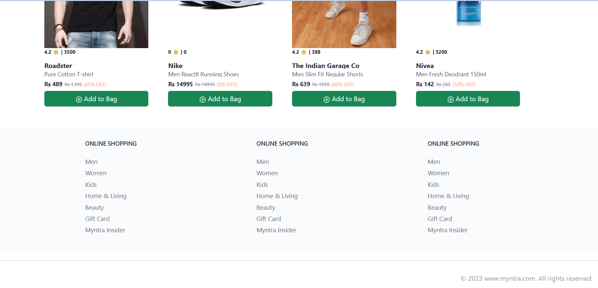

# Myntra Clone – React + Node.js

A Myntra-inspired e-commerce frontend built with ***React + Vite and a Node.js + Express*** backend using JSON-based mock data.

This project demonstrates modern frontend development, state management, and API integration.


## Features

- Product listing & details
- Add / remove items from cart
- Cart quantity management
- Global state management with Redux Toolkit
- Client-side routing with React Router
- Responsive UI using Bootstrap
- REST API integration with Express


## Tech Stack

### Frontend

- React (Vite)
- Redux Toolkit
- React Router DOM
- Bootstrap 5
- React Icons


### Backend

- Node.js
- Express.js
- JSON files (mock database)

### Tools

- Git, GitHub, npm, Thunder Client


## Project Structure
```
Myntra-React-Clone/
├── backend/      # Express APIs + JSON data
├── frontend/     # React (Vite) application
├── .gitignore
└── README.md

```

## Setups
```
# Backend
cd backend
npm install
npm start

# Frontend
cd frontend
npm install
npm run dev

```

## 📸 Screenshots

### Myntra React Clone





## Limitations

- No authentication
- No database (JSON-based data)
- No payment gateway


## Future Improvements

- User authentication (JWT)
- Database integration (MongoDB)
- Admin dashboard
- Payment gateway

## Author

***Sanish Kumar***

`Aspiring Full-Stack Developer | Flask | Data Scienece | Machine Learning | Deep Learning & GenAI `

- **Email:** sanishbux42@gmail.com
- **Linkedin:** https://www.linkedin.com/in/sanish-kumar-singh-163679289
- **Acadedmic Github:** https://github.com/23f3001252


----

⭐ Give a ***`Star`*** if it is helpful and impactful. 

`This project is built for learning and portfolio purposes.`


----

# THNAK YOU FOR VISITING!             

